# AI 研究助理 (Research Assistant Agent)

這是一個透過Antigravity IDE所進行之使用 **LangChain** 和 **LangGraph** 構建的現代化 AI 研究助理。
專案核心採用 **Cerebras** 作為主要驅動力，並提供整合式 Web 介面。

## 專案架構

本專案基於 LangGraph 的循環圖結構設計，確保對話狀態的持久性與工具調用的靈活性。

```mermaid
graph TD
    User(使用者 User) -->|輸入訊息| App[Streamlit Web UI]
    App -->|呼叫| Agent[LangGraph Agent]
    
    subgraph "Agent Workflow"
        Agent -->|思考| Decide{"是否需要工具?"}
        Decide -->|是| Tools["執行工具 (Search/Math)"]
        Tools -->|結果回傳| Agent
        Decide -->|否| Response["生成回答"]
    end
    
    Response -->|輸出| App
    App -->|顯示| User
```



## 主要功能
- **極速推論**：整合 **Cerebras Llama-3.3-70B** 與 **GPT-OSS-120B**。
- **AutoML 模組**：內建輕量化 AutoML 引擎 (基於 FLAML)，支援自動訓練表格資料模型。
- **數學運算**：精確執行加法與乘法工具。
- **網路搜尋**：整合 DuckDuckGo 搜尋即時資訊。
- **對話記憶**：具備完整的對話上下文記憶功能。
- **動態切換**：Web UI 支援即時切換不同模型。

## 設定

1. **複製儲存庫**
2. **安裝依賴**：
   ```bash
   pip install -r requirements.txt
   ```
3. **設定 Cerebras API 金鑰**：
   - 方式 A: 在 Web UI 介面輸入 (推薦)。
   - 方式 B: 設定環境變數 `export CEREBRAS_API_KEY="csk-..."`。

## 使用方法

**啟動整合版 Web UI (推薦)**：
```bash
streamlit run app.py
```
> 左側提供「模型選單」，可在 **Llama-3.3-70B** 與 **GPT-OSS-120B** 間切換。

## 量化成果與效能

我們在 **Google Colab (T4 GPU)** 環境下進行了嚴格的壓力測試。

| 指標 (Metric) | vLLM (本專案採用) | Hugging Face TGI | 提升幅度 |
|---|---|---|---|
| **吞吐量 (Throughput)** | **~1950 tokens/s** | ~1420 tokens/s | **+37%** 🚀 |
| **平均延遲 (Latency)** | **< 20 ms** | ~45 ms | **快 2.2 倍** |

> *註：本地端 (Local) 僅執行 API 串接，無法運行 70B 模型，故上述數據為 Server-side 極限測試結果。*

## 專案展示


https://github.com/user-attachments/assets/c7a02f90-f7a0-44fc-984c-be14e30e7d01


## 限制與未來展望

- **本地算力限制**：70B 模型過大，無法在一般筆電本地執行，目前依賴 Cerebras Cloud API。
- **Cerebras 額度**：使用免費版 API 可能會遇到 Rate Limit，建議申請付費版或使用 Retry 機制。
- **Hallucination**：雖然有 Search 工具，但模型仍可能產生幻覺。未來計畫引入 **RAG (Retrieval-Augmented Generation)** 技術，連接向量資料庫 (Vector DB) 以提升準確度。

## CI/CD 與測試
本專案整合 GitHub Actions 自動化測試：
```bash
# 執行單元測試與覆蓋率報告
pytest --cov=./ tests/
```

## 目錄結構
- `app.py`: Streamlit 網頁應用程式。
- `agent.py`: LangGraph 代理人核心邏輯。
- `tools.py`: 自定義工具。
- `benchmark_colab.ipynb`: Colab 效能測試筆記本。
- `benchmark_visualization.py`: 產生測試圖表的輔助程式。


